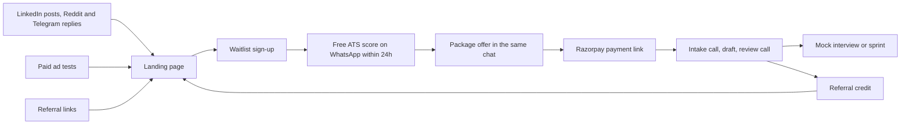

# Go-to-market

## Principle

Spend time before money. The founder's own content and community presence are the primary channel; the INR 50,000 ad budget exists to test whether paid acquisition can ever work, not to carry the business. Every channel is tagged in the waitlist `source` field so that paid conversion by channel is measurable from day one.

## Funnel

Target conversion rates (all assumptions, tagged GTM-n):

| Step | Target | Tag |
| --- | --- | --- |
| Landing page visit to waitlist sign-up | 8% (organic), 3-4% (paid) | GTM-1 |
| Waitlist sign-up to free score requested | 70% | GTM-2 |
| Free score delivered to paid order within 30 days | 10-15% | GTM-3 |
| Paid resume customer to mock interview or sprint within 60 days | 25% | GTM-4 |
| Paid customer refers at least one paying customer within 90 days | 20% | GTM-5 |

## Pre-launch (weeks 1-4): build the waitlist to 50

1. **Landing page live** (this repo). Hero, how it works, packages and pricing, before/after sample, guarantees, FAQ, waitlist form. Two price variants of the Resume Rewrite package (INR 1,999 and INR 2,499) shown to alternate visitors for the price test described in [02-business-model.md](02-business-model.md).
2. **Founder LinkedIn**: 3 posts a week for 4 weeks. Formats that work in this category: a single resume bullet rewritten before/after with the reasoning; "I reviewed 20 resumes from r/developersIndia, here are the 5 mistakes"; a short story of a switch that doubled someone's CTC and what changed on paper. Every post ends with the free ATS score offer.
3. **Reddit**: 5 genuinely useful resume-review comments a week in r/developersIndia and r/IndianWorkplace. No links in comments; profile bio links to the landing page. Reddit punishes promotion and rewards competence.
4. **Telegram**: join 10 large job-opening channels and their discussion groups; answer resume and interview questions. Ask 2-3 admins about a pinned post in exchange for free ATS scores for their members.
5. **Personal network**: 30 direct messages to former colleagues who switched recently, asking for a 15-minute call about how they prepared. This is customer research that also produces the first 10 sign-ups.

Exit criterion: 50 waitlist sign-ups. If under 25 after 4 weeks, the message or the ICP is wrong; run 10 more research calls before spending on ads.

## Launch (months 1-2): first 10 paid orders

- Deliver free ATS scores within 24 hours to every sign-up. The score message includes three specific, named fixes (not generic advice) and one sentence offering the package. Specificity is the sales pitch.
- Offer the first 10 customers a founding-customer price (INR 1,999 for Resume Rewrite) in exchange for a LinkedIn recommendation and permission to use an anonymised before/after.
- Start the paid ad test: INR 8,000 a month across two creatives on LinkedIn (job title targeting: software engineer, analyst, consultant; 2-8 years) and Meta (interest targeting: Naukri, LinkedIn, job search). Kill any ad with CAC above INR 1,200 after INR 4,000 spent.
- Publish the first two case studies on the landing page.

## Growth (months 3-6): referrals and community

- **Referral programme**: INR 500 credit to both sides, delivered as a Razorpay discount code. Announced at delivery, on the review call, and in a follow-up message 30 days later when the customer has had interviews.
- **Appraisal-season campaign** (April-June): the highest-intent period. Content series on "what to do when your hike is 7%". Ad budget concentrated here.
- **Layoff response**: a pre-written landing-page variant and LinkedIn post template for layoff news days offering a discounted rewrite to affected employees of the named company. Fast response wins these.
- **Community partnerships**: offer free ATS scores to members of 3-5 college alumni groups or bootcamp cohorts (Scaler, Masai, Newton School alumni are active switchers) in exchange for a pinned announcement.
- **Mock interview tier launch**: once 30 resume customers exist, announce mock interviews to them first. Existing customers are the cheapest channel.

## Scale (months 7-12): content compounding and the sprint tier

- Weekly long-form LinkedIn article or newsletter on switching in India (salary bands, notice-period tactics, company interview patterns). This is SEO-adjacent content that also feeds a future blog.
- Launch the 30-Day Sprint publicly with two named case studies.
- Recruit 2-3 "success story" customers to record 60-second testimonials.
- Test B2B: offer a bulk outplacement package to two startups that have announced layoffs (INR 1,499 per employee for a resume rewrite, minimum 20). Not in the projection; upside only.

## Channel budget and effort

| Channel | Cash (year 1) | Founder hours per week | Expected share of orders by month 12 |
| --- | --- | --- | --- |
| LinkedIn content | 0 | 5 | 35% |
| Referrals | ~30,000 in credits (in direct costs) | 1 | 25% |
| Reddit and Telegram | 0 | 3 | 15% |
| Paid ads | 50,000 (months 1-4) plus 5,000 a month after | 2 | 15% |
| Partnerships and alumni groups | 0 | 1 | 10% |

## Messaging

Headline: **Get interviews, not a template.**

Sub-headline: Resume, LinkedIn and interview prep for Indian professionals with 2-8 years of experience. Written with you on a call, formatted for Naukri and ATS, delivered in 3 days, backed by a 45-day call-back guarantee.

Proof points to display: turnaround, guarantee, before/after sample, number of resumes reviewed (update monthly), LinkedIn recommendations.

Words to avoid: "guaranteed job", "100% placement", "premium", "best". Words to use: specific numbers, company archetypes, "call-back", "ATS-parsed", "Naukri-ready".

## Landing page and waitlist form

Fields, in order: email (required), name (required), current role (required), years of experience (required, 0-2 / 2-4 / 4-8 / 8+), target role (optional), city (optional), source (hidden, from the URL query or a "how did you hear about us" select).

Why these fields: years of experience segments the ICP immediately; current and target role let the founder personalise the free ATS score message; source is what makes channel-level CAC measurable. Phone is not asked at sign-up (drop-off); it is collected on WhatsApp when the score is requested.

## Assumptions to validate

| ID | Assumption | Validation | Kill criterion |
| --- | --- | --- | --- |
| GTM-1 | 8% organic landing conversion | Analytics on the landing page in month 1 | Under 3% means the page or the traffic is wrong |
| GTM-3 | 10-15% score-to-paid conversion | Waitlist database, 30-day window | Under 5% after 100 scores |
| GTM-5 | 20% of customers refer a paying customer | Referral code usage | Under 10% by month 8 |
| GTM-6 | Reddit and Telegram produce paying customers | Source field in the database | Zero paid orders from a channel with 50+ sign-ups |
| GTM-7 | Appraisal season produces at least a 50% lift in sign-ups | Compare April-June with January-March | No lift means seasonality assumptions in the P&L are wrong |
