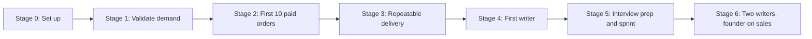

# Roadmap

Milestones are sequenced by dependency and gated by evidence, not by calendar. Each stage has an entry condition, the work, and an exit signal. The month numbers match the projection in [04-unit-economics.md](04-unit-economics.md) and are targets, not commitments.

## Stage 0: Set up (before month 1)

Entry: decision to proceed.

Work:
- Register the domain; deploy this landing page to Vercel; connect the Neon database.
- Udyam registration, current account, Razorpay KYC.
- Publish terms of service and refund policy.
- Write the free ATS score message template, intake form, rubric, WhatsApp templates.
- Produce 2 before/after samples from the founder's own or friends' resumes (with consent).
- Draft 12 LinkedIn posts.

Exit: landing page live, payments testable end to end, INR 45,000 spent at most.

## Stage 1: Validate demand (month 1)

Entry: Stage 0 complete.

Work:
- Publish 3 LinkedIn posts a week, 5 Reddit comments a week, join 10 Telegram groups.
- 30 research calls with recent switchers.
- Deliver free ATS scores to every sign-up within 24 hours.
- Run the INR 1,999 vs 2,499 price test on the landing page.
- Start the first INR 8,000 ad test.

Exit signal: **50 waitlist sign-ups** and at least 3 paid orders. Kill or pivot signal: under 25 sign-ups after 4 weeks with content running, or research calls consistently saying they would not pay for this.

## Stage 2: First 10 paid orders (month 2)

Entry: Stage 1 exit signal.

Work:
- Founding-customer offer (INR 1,999) for the first 10 in exchange for a recommendation and an anonymised before/after.
- Deliver every order personally; time-track each step.
- Collect a 3-question survey at delivery (would you have paid without the call; what almost stopped you; who else should we talk to).
- Publish two case studies.

Exit signal: **10 paid orders, average order value at or above INR 3,000, at least 5 LinkedIn recommendations.** Turnaround SLA met on 9 of 10.

## Stage 3: Repeatable delivery (months 3-4)

Entry: Stage 2 exit.

Work:
- Lock pricing based on the price test.
- Launch the referral programme.
- Appraisal-season content campaign if the calendar aligns.
- Convert the order-tracking spreadsheet into a checklist that a writer could follow.
- Recruit and trial 3 writers on paid samples (not yet delivering customer work).

Exit signal: **INR 50,000 monthly revenue** (15-20 orders), score-to-paid conversion at or above 10%, at least 2 writers passed the rubric trial.

## Stage 4: First contracted writer (months 5-6)

Entry: Stage 3 exit and founder delivery hours above 60 a month.

Work:
- First writer takes 40% of resume orders; founder QAs every draft.
- Founder's freed time goes to content, partnerships with alumni groups, and building the mock interview question banks for three company archetypes.
- Launch mock interviews to existing customers first.

Exit signal: **INR 90,000 monthly revenue**, writer pass rate above 80% on first QA, at least 5 mock interviews sold.

## Stage 5: Interview prep and sprint (months 7-9)

Entry: Stage 4 exit.

Work:
- Public launch of the 30-Day Sprint with two named case studies.
- Weekly long-form content (newsletter or LinkedIn article).
- Recruit a second writer to the bench; recruit one interviewer (a working engineering manager or HR lead) at INR 600 per mock.
- Layoff-response playbook ready and tested once.

Exit signal: **INR 1,50,000 monthly revenue**, 20% of orders from referrals, sprint tier at least 10% of revenue.

## Stage 6: Two writers, founder on sales (months 10-12)

Entry: Stage 5 exit.

Work:
- Second writer active; writers handle 70% of resume orders.
- Founder focuses on sales conversations, review calls, interviews and QA.
- Test one B2B outplacement deal.
- Decide on GST registration timing (voluntary at INR 15 lakh cumulative).
- Move order tracking from the spreadsheet into a table in the Neon database with a simple admin view.

Exit signal: **INR 2,50,000 monthly revenue**, founder pay of INR 60,000 a month sustained for 3 months, net margin above 40% after founder pay.

## Decisions deferred to month 12

- Entity conversion to LLP or private limited (only if hiring employees or taking B2B contracts that require it).
- A self-serve ATS checker product at INR 199 (only if the free score funnel is saturating founder time).
- Expansion to freshers or senior leaders (different products; only with a second full-time person).
- Paid SEO or blog investment (only if LinkedIn reach is declining).

## What would make me stop

- Fewer than 25 sign-ups after a month of consistent content and 30 research calls.
- Score-to-paid conversion under 5% after 100 free scores despite two changes to the offer message.
- Month-6 revenue under INR 30,000 with the founder working full time.

Any of these means the market is not paying for this version of the product; the shortlist in [01-idea-shortlist.md](01-idea-shortlist.md) has the next candidate.
